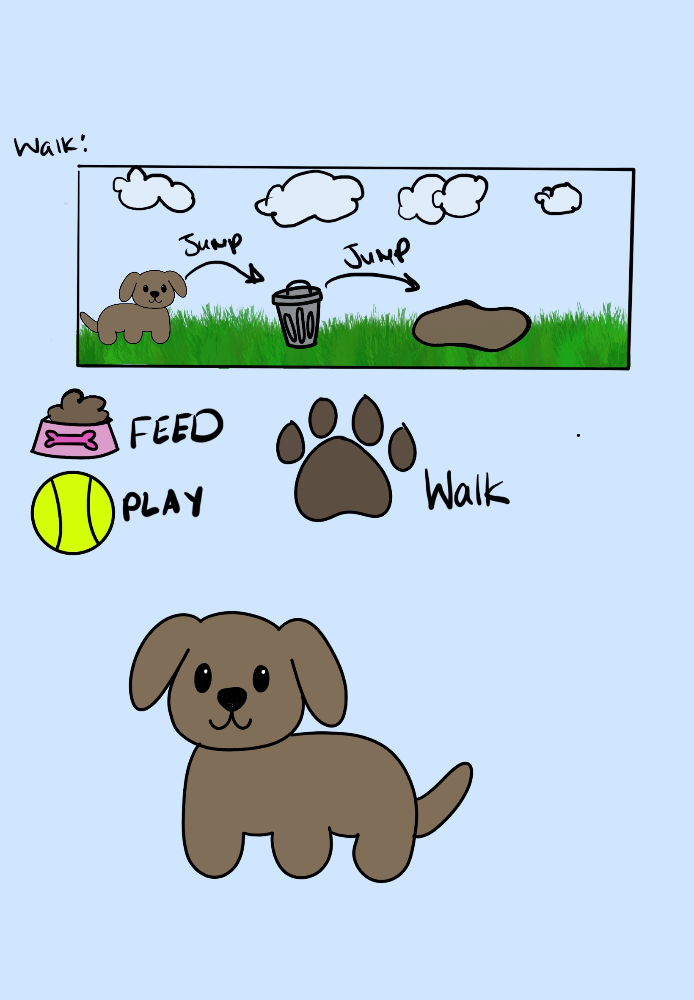
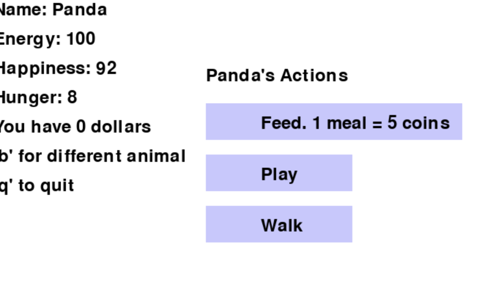

# Pet Simulator
## CS110 Final Project  Fall, 2024

## Team Members

Victoria Berfirer

***

## Project Description

This is a virtual pet simulator. There are three different pets, each with a different image. The goal is to keep the pet alive by continuously feeding it and keeping it happy. If the user chooses to walk the dog, it opens up a really simple scrolling game where the user collects money to feed the dog. The "play" feature opens a trivia game. These features both earn the user money that they can use to feed the dog and keep it alive.
***    

## GUI Design

### Initial Design

### Final Design

## Program Design

### Features

1. scrolling background
2. trivia game
3. menu with options to click on >>
4. start menu
5. multiple animals=

### Classes
Animal: defines the pet and the actions it can do
Controller: facilitates the game to move from screen to screen
Dog: creates a seperate dog image and name as a subclass of the Animal class
Snake: creates a seperate snake image and name as a subclass of the Animal class
Panda: creates a seperate panda image and name as a subclass of the Animal class
Game: creates the features of the scrolling game
Obstacle: creates the obstacles that are used in the scrolling game
Text: creates a program to make text appear on the screen
Play: calls and implements the API to create the trivia game

###
pip install requests (Pypi)

## ATP

Test 1: Menu page functionality
    Test Steps:
        1. run the code
            - python3 main.py
            - wait for instruction page to dissapear
        2. pick an animal
        2  click "walk"
        3. verify that the scrolling game opens up
    Expected Outcome: the scrolling game open up

Test 2: jump functionality:
    Test steps: 
        1. run the code
            - python3 main.py
            - wait for instruction page to dissapear
        2. pick an animal
        3. click the walk button
        4. click the space button
        5. make sure that the animal jumps 
    Expected Outcome: the animal jumps

Test 3: trivia game functionality
    Test steps:
        1. run the code
            - python3 main.py
            - wait for instruction page to dissapear
        2. pick an animal
        3. click the play button
        4. wait for the instruction page to dissappear
        5. verify that a trivia question appears
    Expected outcome: pressing play should lead to a trivia game

Test 4: trivia game play
    Test steps:
        1. run the code
            - python3 main.py
            - wait for instruction page to dissapear
        2. pick an animal
        3. click the play button
        4. wait for the instruction page to dissappear
        5. press a key 1-4 on your keyboard
        6. verify that your answser is checked and tells you if it correct or not
    Expected outcome: pressing a key 1-4 should allow you to pick an answer choice equivalent to it and tell you if it is correct

Test 5: feed functionality
    Test steps:
        1. run the code
            - python3 main.py
            - wait for instruction page to dissapear
        2. pick an animal
        3. click the walk button
        4. play the scrolling game by jumping over trash cans and collecting coins
        5. play until your score becomes 5
        6. die by colliding with a trash can or cloud
        7. press feed
        8. verify that the hunger decreases by 10

    Expected outcome: pressing a key 1-4 should allow you to pick an answer choice equivalent to it and tell you if it is correct